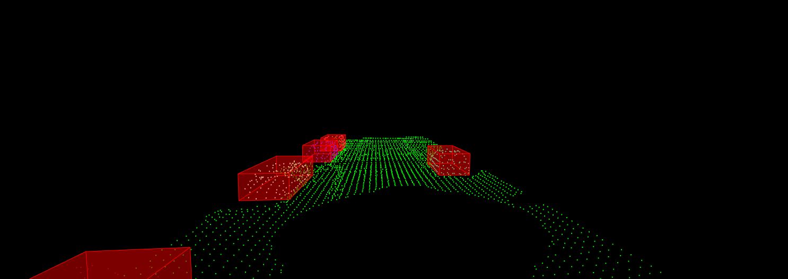
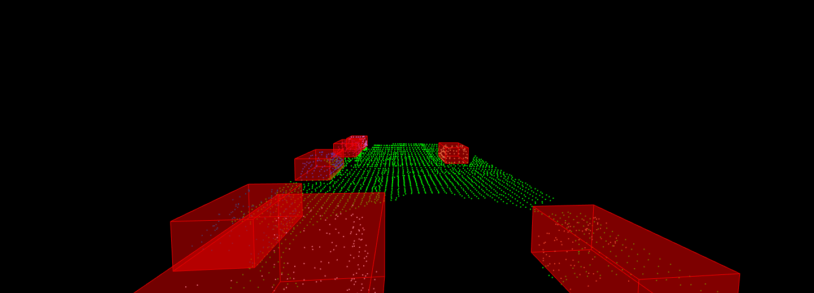
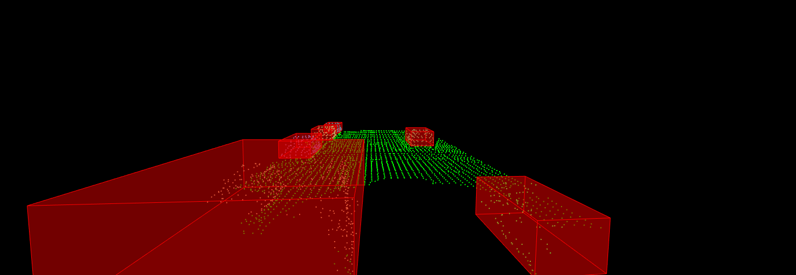

# LidarObstacleDetection


This is the first project of Sensor Fusion Udacity Nanodegree, where the goal is detect other cars on the road using raw lidar data from Udacity’s real self-driving car, Carla! Implement custom RANSAC and euclidean clustering algorithms.

Link of the course: https://www.udacity.com/course/sensor-fusion-engineer-nanodegree--nd313

In the next image we will see an animation of the program

 


## Getting Started


### Prerequisites

For the compile we will need PLC library for lidar points processor.

* PLC library
```
sudo add-apt-repository -y ppa:webupd8team/java && sudo apt update && sudo apt -y install oracle-java8-installer

sudo apt -y install g++ cmake cmake-gui doxygen mpi-default-dev openmpi-bin openmpi-common libusb-1.0-0-dev libqhull* libusb-dev libgtest-dev
sudo apt -y install git-core freeglut3-dev pkg-config build-essential libxmu-dev libxi-dev libphonon-dev libphonon-dev phonon-backend-gstreamer
sudo apt -y install phonon-backend-vlc graphviz mono-complete qt-sdk libflann-dev     


cd ~/Downloads
wget http://launchpadlibrarian.net/209530212/libeigen3-dev_3.2.5-4_all.deb
sudo dpkg -i libeigen3-dev_3.2.5-4_all.deb
sudo apt-mark hold libeigen3-dev

wget http://www.vtk.org/files/release/7.1/VTK-7.1.0.tar.gz
tar -xf VTK-7.1.0.tar.gz
cd VTK-7.1.0 && mkdir build && cd build
cmake ..
make                                                                   
sudo make install

cd ~/Downloads
wget https://github.com/PointCloudLibrary/pcl/archive/pcl-1.8.0.tar.gz
tar -xf pcl-1.8.0.tar.gz
cd pcl-pcl-1.8.0 && mkdir build && cd build
cmake ..
make
sudo make install

cd ~/Downloads
rm libeigen3-dev_3.2.5-4_all.deb VTK-7.1.0.tar.gz pcl-1.8.0.tar.gz
sudo rm -r VTK-7.1.0 pcl-pcl-1.8.0
```


### Installing


Download the project

```
git clone https://github.com/AngelVelazquezR/LidarObstacleDetection.git
```

## Running the tests

For running a test we have to go to the root and create build folder

```
cd LidarObstacleDetection
mkdir build
cd build
```

Compile and generate the execute

```
cmake ..
make
```

Finally we will run the program

```
./environment
```

### Main executed

An animation like the one seen in the description will be displayed, here are several images with some results. where we can notice that the cars are clustered correct.

 
 
 


## Authors

* **Angel Velazquez** - *Initial work* - [GitHub](https://github.com/AngelVelazquezR)

